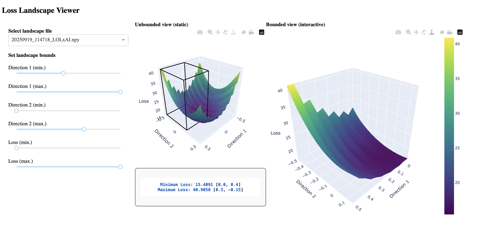

Examples
========

Quick Start
-----------

.. code-block:: python

   import torch
   import torch.nn as nn
   import oxford_loss_landscapes as oll

   # Create a simple model and loss function
   model = nn.Sequential(
       nn.Linear(10, 5),
       nn.ReLU(),
       nn.Linear(5, 1)
   )
   criterion = nn.MSELoss()

   # Generate some dummy data
   inputs = torch.randn(100, 10)
   targets = torch.randn(100, 1)

   # Wrap the model
   model_wrapper = oll.ModelWrapper(model, criterion, inputs, targets)

   # Compute a random 2D loss landscape
   landscape = oll.random_plane(model_wrapper, distance=1.0, steps=25)
   print(f"Loss landscape shape: {landscape.shape}")

   # Compute loss at current parameters
   loss_value = oll.point(model_wrapper)
   print(f"Current loss: {loss_value}")

Dashboard Example
=================

This example demonstrates how to generate and explore an **interactive loss landscape dashboard**.

The script used is ``cnn_usage.py`` from the ``examples`` directory.

Step 1: Generate the 2D Plane with Export
-----------------------------------------

To use the interactive dashboard, the calculation of the 2D plane must include the ``export=True`` argument.
The current example has been modified to include this argument in the call to ``random_plane``, like so:

.. code-block:: python

   plane_losses = oll.random_plane(
       model_wrapper,
       loss_metric,
       distance=1.0,
       steps=21,
       normalization='model',
       export=True
   )

This will generate a **results** directory in the location where the script is run.

.. note::

   If you only add the ``export=True`` modification to the basic example without adapting the rest of the code,
   you may encounter the following error:

   .. code-block:: text

      AttributeError: 'NoneType' object has no attribute 'shape'

   This occurs because ``random_plane`` does not return data when ``export=True`` — instead, results are written
   to the generated directory for use with the dashboard.

Step 2: Launch the Dashboard
----------------------------

Once the results directory has been generated, launch the dashboard from the same directory:

.. code-block:: bash

   python ./oxford_rse_project4/src/oxford_loss_landscapes/dashboard/gui_loss_dash.py

Typical output may look like:

.. code-block:: text

   /usr/local/anaconda3/envs/charmm/lib/python3.13/site-packages/dash/dash.py:22: UserWarning: pkg_resources is deprecated as an API...
   Dash is running on http://127.0.0.1:8097/

   * Serving Flask app 'gui_loss_dash'
   * Debug mode: on

Click on the ``http://127.0.0.1:8097/`` link to open the dashboard in your browser.

Step 3: Explore the Dashboard
-----------------------------

The dashboard provides several interactive features, each with icons in the top-right corner of the dashboard:

- **Download PNG** of landscape
- **Zoom**, **Pan**, **Orbital rotation**, and **Turnable rotation**
- **Reset to default view** or **reset to last view**

There are two modes:

- **Unbounded view**  
- **Bounded view** — modified using the sliding bars on the left-hand side (to adjust bounds in two directions and the loss).

Dashboard Screenshot
--------------------

   Users view of the dashboard for ``cnn_usage.py``.
